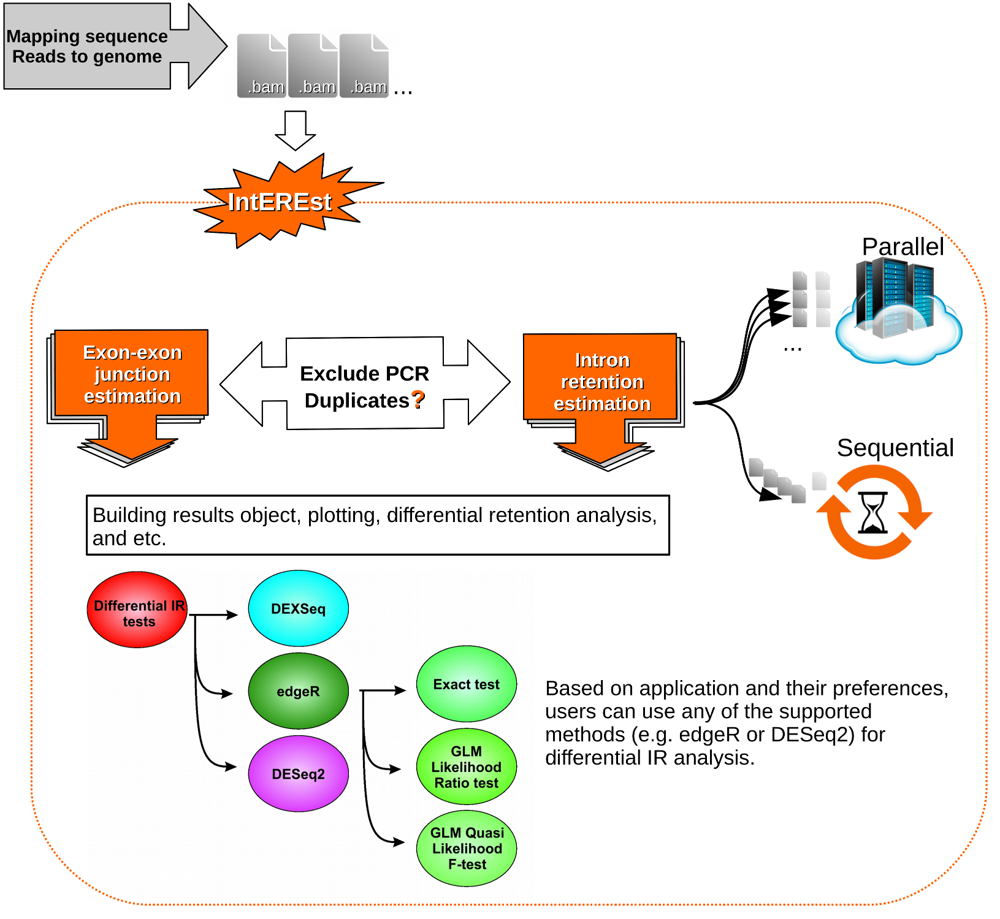
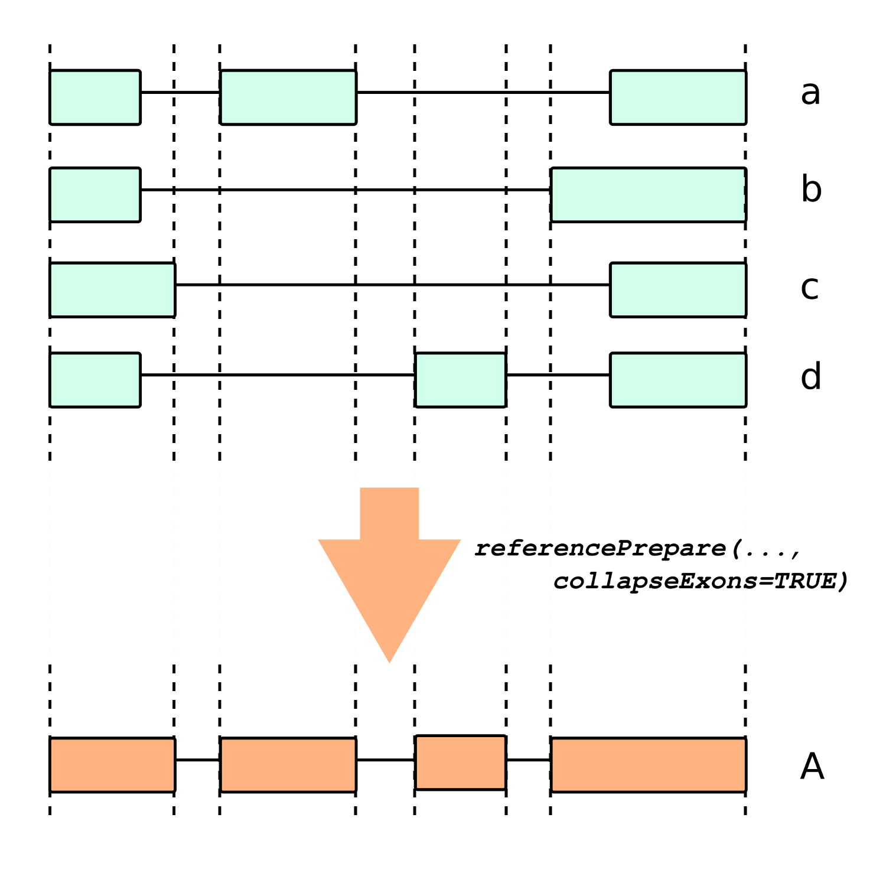

In this documents the following subjects have been covered:

* [Introduction to IntEREst](#Intro)
* [Creating reference](#refCr)
* [Annotating U12 type introns](#annoU12)
* [Intron retention, Inton spanning and exon-exon junction level estimation](#readSum)
* [Using the test data mdsChr22Obj](#dataUse)
* [Comparing intron retention levels across various samples](#irCompare)
* [Our recommended pipeline for differential intron retention analysis](#difanalysis)


## Introduction to IntEREst {#Intro}
The IntEREst, *i.e.* Intron Exon Retention Estimator (Oghabian 
*et al.* [-@pmid29642843]), facilitates estimation and comparison of splicing 
efficiency of transcripts across several samples. In particular, It can 
estimate the intron-retention levels or the exon-exon junction levels across 
the transcripts. Similar to the Intron retention analysis used by Niemelä
*et al.* [-@pmid24848017], our method estimates the Intron-mapping read levels
by counting the number of RNAseq reads that have been mapped to the Intron-exon
junctions of the genes, additionally it can estimate the exon-exon junction 
levels by counting the reads that have been mapped to the exons or by counting 
reads that span the introns. 
It is also possible to limit the analysis to reads that are mapped to
the intron-exon or exon-exon junctions only and filter the ones that fully map
to the introns/exons (See the `junctionReadsOnly` parameter in the `interest()`
and `interest.sequential()` functions). However, by default this limitation is 
not taken into account, *i.e.* the reads that are fully mapped to the introns 
or exons are also considered.
The package accepts standard BAM files as input and produces tab separated text
files together with `SummarizedExperiment` objects as results. To improve the 
performance and running time, the processing of each single BAM file can be 
divided to smaller processes and distributed and run on several computing 
cores. Using IntEREst functions the results can also be plotted and 
statistically analyzed to screen the distribution of the intron retention 
levels, and compare the retention levels of U12 type introns to the U2 type 
across the studied samples. Note that although we mainly use this package to 
compare the retention of U12-type introns to the U2 type, comparisons for other
sub-classes of introns (defined by the user) can also be performed, however the
functions `u12NbIndex()`, `u12Index()`, `u12Boxplot()`, `u12BoxplotNb()`, 
`u12DensityPlot()`and `u12DensityPlotIntron()` in IntEREst are specifically 
used for U12-type introns. A diagram of the running pipeline is shown in 
*figure 1*. 

<br>
```{r pipeline, out.width = 500, ppi=100, fig.retina = NULL, fig.align="center", echo=FALSE, eval=TRUE, fig.cap="**Figure 1:** Diagram of IntEREst running pipeline" }

```
<br>

## Creating reference {#refChr}
The first step is to build a reference which will be used for the summarization
of the sequence reads, and also downstream analysis (e.g. significant 
differential IR analysis). This can be carried out by `referencePrepare()` 
function. The resulted reference data frame includes coordinates of introns and
exons of the genes; They can be extracted from various sources i.e. UCSC, 
biomaRt or a user defined file (e.g. GFF3/GTF). The exons with overlapping 
genomic coordinates can be collapsed (if `collapseExons` parameter is set as 
`TRUE`) to avoid assigning reads mapping to any alternatively skipped exons to 
their overlapping introns. An example of the process is shown in *figure 2*.
<br>
```{r collapseExons, out.width = 500, ppi=100, fig.retina = NULL, fig.align="center", echo=FALSE, eval=TRUE, fig.cap="**Figure 2:** Running reference isoforms a, b, c and d leads to gene A with exons that are results of collapsing of exons of all isoforms." }

```
<br>
Here we build a reference data frame from a manually built GFF3 file that 
includes exonic coordinates of the gene RHBDD3. 
<br>
```{r reference_build, out.width = 500, echo=TRUE, eval=TRUE }
# Load library quietly
suppressMessages(library("IntEREst"))
# Selecting rows related to RHBDD3 gene
tmpGen<-u12[u12[,"gene_name"]=="RHBDD3",]
# Extracting exons
tmpEx<-tmpGen[tmpGen[,"int_ex"]=="exon",]

# Building GFF3 file
exonDat<- cbind(tmpEx[,3], ".",
	tmpEx[,c(7,4,5)], ".", tmpEx[,6], ".",paste("ID=exon",
	tmpEx[,11], "; Parent=ENST00000413811", sep="") )
trDat<- c(tmpEx[1,3], ".", "mRNA", as.numeric(min(tmpEx[,4])),
	as.numeric(max(tmpEx[,5])), ".", tmpEx[1,6], ".",
	"ID=ENST00000413811")
outDir<- file.path(tempdir(),"tmpFolder")
dir.create(outDir)
outDir<- normalizePath(outDir)
gff3File<-paste(outDir, "gffFile.gff", sep="/")
cat("##gff-version 3\n",file=gff3File, append=FALSE)
cat(paste(paste(trDat, collapse="\t"),"\n", sep=""),
	file=gff3File, append=TRUE)
write.table(exonDat, gff3File,
	row.names=FALSE, col.names=FALSE,
	sep='\t', quote=FALSE, append=TRUE)

# Extracting U12 introns info from 'u12' data
u12Int<-u12[u12$int_ex=="intron"&u12$int_type=="U12",]

# Building reference
#Since it is based on one gene only (that does not feature alternative splicing
#events) there is no difference if the collapseExons is set as TRUE or FALSE
testRef<- referencePrepare (sourceBuild="file",
	filePath=gff3File, u12IntronsChr=u12Int[,"chr"],
	u12IntronsBeg=u12Int[,"begin"],
	u12IntronsEnd=u12Int[,"end"], collapseExons=TRUE,
	fileFormat="gff3", annotateGeneIds=FALSE)

head (testRef)
```
<br>

## Annotating U12 type introns {#annoU12}
It is possible to annotate the U12 type introns in a reference using the 
`annotateU12` function. U12-type introns (also known as minor type introns) are
detected and spliced by the U12 splicing machinery as opposed to the majority 
of the introns (known as major type or U2 type) which are spliced by the U2 
spliceosome. U12-type introns also feature evolutionary conserved splice sites 
which are distinguished from the splice sites of U2 type introns hence they can
be detected by mapping a position weigh matrix (PWM) to their splice sites and 
measuring their match score based on the PWM. The following scripts
re-annotates introns of the genes RHBDD2 and YBX2.
<br>
```{r annotate_u12, out.width = 500, echo=TRUE, eval=TRUE }
# Improting genome
BSgenome.Hsapiens.UCSC.hg19 <-
BSgenome.Hsapiens.UCSC.hg19::BSgenome.Hsapiens.UCSC.hg19
#Index of the subset of rows
ind<- u12$gene_name %in% c("RHBDD2", "YBX2")

# Annotate U12 introns with strong U12 donor site, branch point
# and acceptor site from the u12 data in the package
annoU12<-
	annotateU12(pwmU12U2=list(pwmU12db[[1]][,11:17],pwmU12db[[2]],
		pwmU12db[[3]][,38:40],pwmU12db[[4]][,11:17],
		pwmU12db[[5]][,38:40]),
	pwmSsIndex=list(indexDonU12=1, indexBpU12=1, indexAccU12=3,
		indexDonU2=1, indexAccU2=3),
	referenceChr=u12[ind,'chr'],
	referenceBegin=u12[ind,'begin'],
	referenceEnd=u12[ind,'end'],
	referenceIntronExon=u12[ind,"int_ex"],
	intronExon="intron",
	matchWindowRelativeUpstreamPos=c(NA,-29,NA,NA,NA),
	matchWindowRelativeDownstreamPos=c(NA,-9,NA,NA,NA),
	minMatchScore=c(rep(paste(80,"%",sep=""),2), "40%",
	paste(80,"%",sep=""), "40%"),
	refGenome=BSgenome.Hsapiens.UCSC.hg19,
	setNaAs="U2",
	annotateU12Subtype=TRUE)
# How many U12 and U2 type introns with strong U12 donor sites,
# acceptor sites (and branch points for U12-type) are there?
	table(annoU12[,1])
```
<br>

## Intron retention, Inton spanning and exon-exon junction level estimation {#readSum}
The raw counts and normalized intron retention, intron spanning and exon-exon 
junction levels can be estimated using any of the two RNAseq read 
summarization functions, `interest()` and `interest.sequential()`. 
The `interest()` function is more robust since it distributes the reads in the 
.bam file over several computing cores and analyze the distributed data 
simultaneously. Note that regions in the genome with repetitive sequence 
elements may bias the mapping of the read sequences and the retention analysis.
If you wish to exclude these regions from the analysis you can use the 
`getRepeatTable()` function, however We did not find repetitive DNA elements in
particular biasing our results therefore we do not routinely use this function. 
As for instance, if you wish to exclude the coordinates in the genome housing 
Alu elements, you can run the reads summarization functions with the 
`repeatsTableToFilter= getRepeatTable(repFamilyFil= "Alu")` parameter setting. 
Also, to only consider the reads that map to intron-exon or exon-exon
junctions set `junctionReadsOnly= TRUE`, however we recommend setting 
`junctionReadsOnly= FLASE` when measuring the intron retention levels (i.e. 
`method=IntRet`) and setting `junctionReadsOnly= TRUE` when measuring the 
exon-exon junction levels. The `junctionReadsOnly' parameter does NOT apply to
the intron-spanning levels estimation mode (i.e. `method=IntSpan`).

The `interest()` and `interest.sequential()` read summarization functions write
output text files, additionally they can return a `summarizedExperiment` object
for every sample they analyze. As shown in the following test script we, 
however usually prevent the individual runs to return any objects (by setting 
the `returnObj=FALSE`); instead, after running the analysis for all samples we
generate a single `summarizedExperiment` object that includes results of all
analyzed samples. To build such object from the output text files the 
`readInterestResults()` function can be used. In the following scripts a bam 
file from a single MDS sample with mutated ZRSR2 is used which includes all the
reads mapped to the gene RHBDD3 only. We run 3 analysis that results to the 
number of reads mapping to the introns of the gene RHBDD3, number of reads 
spanning the introns of the gene RHBDD3 and the number of junction reads 
mapping to the exons of gene RHBDD3. eventually a `SummarizedExperiment` object 
is built for each of the 3 analysis that includes the read counts together with
the coordinates and annotations of the introns and exons. The same analysis can
be run on multiple .bam files to obtain `SummarizedExperiment` objects that 
include results for all analyzed .bam files.

```{r testInterest, out.width = 500, echo=TRUE, eval=TRUE }
# Creating temp directory to store the results
outDir<- file.path(tempdir(),"interestFolder")
dir.create(outDir)
outDir<- normalizePath(outDir)
# Loading suitable bam file
bamF <- system.file("extdata", "small_test_SRR1691637_ZRSR2Mut_RHBDD3.bam",
	package="IntEREst", mustWork=TRUE)
# Choosing reference for the gene RHBDD3
ref<-u12[u12[,"gene_name"]=="RHBDD3",]

# Intron retention analysis
# Reads mapping to inner introns are considered, hence 
# junctionReadsOnly is FALSE
testInterest<- interest(
	bamFileYieldSize=10000,
	junctionReadsOnly=FALSE,
	bamFile=bamF,
	isPaired=TRUE,
	isPairedDuplicate=FALSE,
	isSingleReadDuplicate=NA,
	reference=ref,
	referenceGeneNames=ref[,"ens_gene_id"],
	referenceIntronExon=ref[,"int_ex"],
	repeatsTableToFilter=c(),
	outFile=paste(outDir,
		"intRetRes.tsv", sep="/"),
	logFile=paste(outDir,
		"log.txt", sep="/"),
	method="IntRet",
	clusterNo=1,
	returnObj=FALSE,
	scaleLength= TRUE,
	scaleFragment= TRUE
)

testIntRetObj<- readInterestResults(
    resultFiles= paste(outDir,
		"intRetRes.tsv", sep="/"), 
    sampleNames="small_test_SRR1691637_ZRSR2Mut_RHBDD3", 
    sampleAnnotation=data.frame( 
        type="ZRSR2mut",
        test_ctrl="test"), 
    commonColumns=1:ncol(ref), freqCol=ncol(ref)+1, 
	scaledRetentionCol=ncol(ref)+2, scaleLength=TRUE, scaleFragment=TRUE, 
	reScale=TRUE, geneIdCol="ens_gene_id")

# Intron Spanning analysis
# Reads mapping to inner introns are considered, hence 
# junctionReadsOnly is FALSE
testInterest<- interest(
	bamFileYieldSize=10000,
	junctionReadsOnly=FALSE,
	bamFile=bamF,
	isPaired=TRUE,
	isPairedDuplicate=FALSE,
	isSingleReadDuplicate=NA,
	reference=ref,
	referenceGeneNames=ref[,"ens_gene_id"],
	referenceIntronExon=ref[,"int_ex"],
	repeatsTableToFilter=c(),
	outFile=paste(outDir,
		"intSpanRes.tsv", sep="/"),
	logFile=paste(outDir,
		"log.txt", sep="/"),
	method="IntSpan",
	clusterNo=1,
	returnObj=FALSE,
	scaleLength= TRUE,
	scaleFragment= TRUE
)

testIntSpanObj<- readInterestResults(
    resultFiles= paste(outDir,
		"intSpanRes.tsv", sep="/"), 
    sampleNames="small_test_SRR1691637_ZRSR2Mut_RHBDD3", 
    sampleAnnotation=data.frame( 
        type="ZRSR2mut",
        test_ctrl="test"), 
    commonColumns=1:ncol(ref), freqCol=ncol(ref)+1, 
	scaledRetentionCol=ncol(ref)+2, scaleLength=TRUE, scaleFragment=TRUE, 
	reScale=TRUE, geneIdCol="ens_gene_id")

# Exon-exon junction analysis
# Reads mapping to inner exons are NOT considered, hence 
# junctionReadsOnly is TRUE
testInterest<- interest(
	bamFileYieldSize=10000,
	junctionReadsOnly=TRUE,
	bamFile=bamF,
	isPaired=TRUE,
	isPairedDuplicate=FALSE,
	isSingleReadDuplicate=NA,
	reference=ref,
	referenceGeneNames=ref[,"ens_gene_id"],
	referenceIntronExon=ref[,"int_ex"],
	repeatsTableToFilter=c(),
	outFile=paste(outDir,
		"exExRes.tsv", sep="/"),
	logFile=paste(outDir,
		"log.txt", sep="/"),
	method="ExEx",
	clusterNo=1,
	returnObj=FALSE,
	scaleLength= TRUE,
	scaleFragment= TRUE
)

testExExObj<- readInterestResults(
    resultFiles= paste(outDir,
		"exExRes.tsv", sep="/"), 
    sampleNames="small_test_SRR1691637_ZRSR2Mut_RHBDD3", 
    sampleAnnotation=data.frame( 
        type="ZRSR2mut",
        test_ctrl="test"), 
    commonColumns=1:ncol(ref), freqCol=ncol(ref)+1, 
	scaledRetentionCol=ncol(ref)+2, scaleLength=TRUE, scaleFragment=TRUE, 
	reScale=TRUE, geneIdCol="ens_gene_id")

# View intron retention result object
testIntRetObj
# View intron spanning  result object
testIntSpanObj
# View exon-exon junction result object
testExExObj

# View first rows of intron retention read counts table
head(counts(testIntRetObj))
# View first rows of intron spanning read counts table
head(counts(testIntSpanObj))
# View first rows of exon-exon junction read counts table
head(counts(testExExObj))

```
<br>

## Using the test data mdsChr22Obj {#dataUse}
As a demo we ran the IntEREst pipeline on 16 .bam files that each includes 
reads mapped to U12 genes (i.e. genes with at least one U12-type intron) 
located in chromosome 22. These bam files were results of mapping RNAseq data 
from bone-marrow samples published by Madan et al. [-@pmid25586593] to the 
Human genome (hg19). The studied samples were extracted from 16 individuals; 
out of which 8 were diagnosed with Myelodysplastic syndrome (MDS) and featured 
ZRSR2 mutation, 4 were diagnosed with MDS but lacked the mutation (referred to 
as ZRSR2 wild-type MDS samples) and 4 were healthy individuals. 

The data is accessible through GEO with the accession number GSE63816 and the 
scripts that we ran to map the RNAseq data, modify the bam files, extract the 
reads mapped to U12 genes in chr22 and build `mdsChr22Obj`, `mdsChr22ExObj`
and `mdsChr22RefIntRetSpObj` objects are available in the `scripts` folder of 
the `IntEREst` package (See the `readme.txt` file in the folder for more 
information). You can get its full path using this script in R: 
`system.file("scripts","readme.txt", package="IntEREst")`. 

The `mdsChr22Obj` object is a `summarizedExperiment` object that includes 
information regarding levels of intron-mapping reads in the U12 genes located 
on the Chromosome 22, across all the 16 MDS samples. The `mdsChr22ExObj` object
contain the levels of exon-exon junction mapping reads and the 
`mdsChr22RefIntRetSpObj` include the levels of intron-spanning reads. Each 
object include two assays: counts and scaledRetention. Both can be accessed 
using functions with the same names: `counts()` and `scaledRetention()`. The 
former (counts) returns a data frame which includes the read counts of each 
intron/exon in each sample, and the latter (scaledRetention) returns a data 
frame with similar dimensions that includes the FPKM normalized read counts. 
The result objects also include intron/exon and sample annotations that can be 
retrieved using `rowData()` and `colData()` functions.

<br>
```{r view_object, out.width = 500, echo=TRUE, eval=TRUE }
# Load library quietly
suppressMessages(library("IntEREst"))
#View object
mdsChr22Obj

mdsChr22ExObj


# See read counts
head(counts(mdsChr22Obj))

# See FPKM Normalized values
head(scaledRetention(mdsChr22Obj))

# See intron/exon annotations
head(rowData(mdsChr22Obj))

# See sample annotations
head(colData(mdsChr22Obj))


```
<br>
It is possible to `plot()` the object to check the distribution of the intron 
retention levels. The following scripts plot the average retention of all 
introns across the 3 sample types: ZRSR2 mutated MDS, ZRSR2 wild type MDS and 
healthy. The `lowerPlot=TRUE` and `upperPlot=TRUE` parameter settings ensures 
that both, the upper and lower triangle of the grid are plotted. 

<br>

```{r plot_intron_object, echo = TRUE, eval=TRUE, message = FALSE, fig.width=6, fig.height=4, fig.align="center", fig.cap="**Figure 3:** Plotting the distribution of the retention levels ($log_e$ scaled retention) of introns of genes located on chromosome 22. The values have been averaged across the sample types ZRSR2 mutated, ZRSR2 wild type, and healthy."}

# Retention of all introns
plot(mdsChr22Obj, logScaleBase=exp(1), pch=20, loessLwd=1.2, 
	summary="mean", col="black", sampleAnnoCol="type", 
	lowerPlot=TRUE, upperPlot=TRUE)
```
<br>

The following script plots the average retention of the U12 introns across the 
3 sample types: ZRSR2 mutated MDS, ZRSR2 MDS wild type and healthy. By default 
the upper triangle of the grid is plotted only (`lowerPlot=FALSE`). 
<br>
```{r plot_u12intron_object, echo = TRUE, eval=TRUE, message = FALSE, fig.width=6, fig.height=4, fig.align="center", fig.cap="**Figure 4:** Plotting the distribution of the retention levels ($log_e$ scaled retention) of introns of genes located on chromosome 22. The values have been averaged across the sample types ZRSR2 mutated, ZRSR2 wild type, and healthy."}

#Retention of U12 introns
plot(mdsChr22Obj, logScaleBase=exp(1), pch=20, plotLoess=FALSE, 
	summary="mean", col="black", sampleAnnoCol="type", 
	subsetRows=u12Index(mdsChr22Obj, intTypeCol="intron_type"))
```
<br>

## Comparing intron retention levels across various samples {#irCompare}
IntEREst also provides various tools to compare the retention levels of the 
introns or exon junction levels across various samples. Initially, we extract 
the significantly higher and lower retained introns by using 
`exactTestInterest()` function which employs the `exactTest()` function from 
the *edgeR* package, i.e. an exact test for differences between two groups of 
negative-binomial counts. Note that `exactTestInterest()` makes comparison 
between a pair of sample types only (e.g. test vs ctrl).  

<br>
```{r exact_test, echo = TRUE, eval=TRUE, message = FALSE, fig.width=6, fig.height=4, fig.align="center"}
# Check the sample annotation table
getAnnotation(mdsChr22Obj)

# Run exact test
test<- exactTestInterest(mdsChr22Obj, 
	sampleAnnoCol="test_ctrl", sampleAnnotation=c("ctrl","test"), 
	geneIdCol= "collapsed_transcripts_id", silent=TRUE, disp="common")

# Number of stabilized introns (in Chr 22)
sInt<- length(which(test$table[,"PValue"]<0.05 
	& test$table[,"logFC"]>0 & 
	rowData(mdsChr22Obj)[,"int_ex"]=="intron"))
print(sInt)
# Number of stabilized (significantly retained) U12 type introns
numStU12Int<- length(which(test$table[,"PValue"]<0.05 & 
	test$table[,"logFC"]>0 & 
	rowData(mdsChr22Obj)[,"intron_type"]=="U12" & 
	!is.na(rowData(mdsChr22Obj)[,"intron_type"])))
# Number of U12 introns
numU12Int<- 
	length(which(rowData(mdsChr22Obj)[,"intron_type"]=="U12" & 
	!is.na(rowData(mdsChr22Obj)[,"intron_type"]))) 
# Fraction(%) of stabilized (significantly retained) U12 introns
perStU12Int<- numStU12Int/numU12Int*100
print(perStU12Int)
# Number of stabilized U2 type introns
numStU2Int<- length(which(test$table[,"PValue"]<0.05 & 
	test$table[,"logFC"]>0 & 
	rowData(mdsChr22Obj)[,"intron_type"]=="U2" & 
	!is.na(rowData(mdsChr22Obj)[,"intron_type"])))
# Number of U2 introns
numU2Int<- 
	length(which(rowData(mdsChr22Obj)[,"intron_type"]=="U2" & 
	!is.na(rowData(mdsChr22Obj)[,"intron_type"])))
# Fraction(%) of stabilized U2 introns
perStU2Int<- numStU2Int/numU2Int*100
print(perStU2Int)
```

<br>
As shown in the previous analysis ~`r trunc(perStU12Int)`% of U12-type introns 
(of genes on Chr22) are significantly more retained (i.e. stabilized) in the 
ZRSR2 mutated samples comparing to the other samples, whereas same comparison 
shows that only ~`r trunc(perStU2Int)`% of the U2-type introns are 
significantly more retained. For more complex experiments such as comparing 
samples based on a user defined design matrix other differential expression 
analysis functions from `edgeR` package, e.g. Linear Model (GLM) functions, 
have also been implemented in IntEREst; `glmInterest()` performs GLM likelihood
ratio test, `qlfInterest()` runs quasi likelihood F-test, and `treatInterest()`
runs fold-change threshold test on the retention levels of the introns/exons. 
DESeq2 and DEXSeq based functions (`deseqInterest()` and `DEXSeqIntEREst()`) 
are also available in the package. Using the QLF `edgeR` based method the 
following commands can be used to extract the data for introns/exons that their
retention levels vary significantly across all sample types: ZRSR2 mutation, 
ZRSR2 wild type, and healthy.

```{r glr_test, echo = TRUE, eval=TRUE, message = FALSE, fig.width=6, fig.height=4, fig.align="center"}

# Extract type of samples
group <- getAnnotation(mdsChr22Obj)[,"type"]
group

# Test retention levels' differentiation across 3 types samples
qlfRes<- qlfInterest(x=mdsChr22Obj, 
	design=model.matrix(~group), silent=TRUE, 
	disp="tagwiseInitTrended", coef=2:3, contrast=NULL, 
	poisson.bound=TRUE)

# Extract index of the introns with significant retention changes
ind= which(qlfRes$table$PValue< 0.05)
# Extract introns with significant retention level changes
variedIntrons= rowData(mdsChr22Obj)[ind,]

#Show first 5 rows and columns of the result table
print(variedIntrons[1:5,1:5])

```
Next, to better illustrate the differences in the retention levels of different
types of introns across the studied samples, we first use the `bopxplot()` 
method to illustrate the retention levels of all U12-type and U2-type introns 
in various sample types, and then we use the `u12BoxplotNb()` function to 
compare the retention of the U12 introns to their up- and down-stream U2-type 
introns.

<br>

```{r boxplot_object, echo = TRUE, eval=TRUE, message = FALSE, fig.width=6, fig.height=4, fig.align="center", fig.cap= "**Figure 5:** Boxplot of the retention levels of U12 introns vs U2 introns, summed over samples with similar annotations *i.e.* ZRSR2 mutation, ZRSR2 wild type, or healthy."}
# boxplot U12 and U2-type introns 
par(mar=c(7,4,2,1))
u12Boxplot(mdsChr22Obj, sampleAnnoCol="type", 
	intExCol="int_ex",	intTypeCol="intron_type", intronExon="intron", 
	col=rep(c("orange", "yellow"),3) ,	lasNames=3, 
	outline=FALSE, ylab="FPKM", cex.axis=0.8)
```
<br>

```{r u12BoxplotNb_object, echo = TRUE, eval=TRUE, message = FALSE, fig.width=6, fig.height=4, fig.align="center", fig.cap="**Figure 6:** Boxplot of retention levels of U12 introns vs their up- and down-stream U2 introns across all samples."}
# boxplot U12-type intron and its up/downstream U2-type introns 
par(mar=c(2,4,1,1))
u12BoxplotNb(mdsChr22Obj, sampleAnnoCol="type", lasNames=1,
	intExCol="int_ex", intTypeCol="intron_type", intronExon="intron", 
	boxplotNames=c(), outline=FALSE, plotLegend=TRUE, 
	geneIdCol="collapsed_transcripts_id", xLegend="topleft", 
	col=c("pink", "lightblue", "lightyellow"), ylim=c(0,1e+06), 
	ylab="FPKM", cex.axis=0.8)
```
<br>

The boxplot clearly shows the increase retention of U12-type introns comparing 
to all the U2 introns (*figure 5*) and in particular comparing to the U2-type 
introns located on the up- or down-stream of the U12-type introns (*figure 6*).
It is also clear that the elevated level of intron retention with U12-type 
introns is exacerbated in the ZRSR2 mutated samples comparing to the other 
studied samples. In order to better illustrate the stabilization of the 
transcripts with U12-type introns comparing to the ones that lack U12-type 
introns, we plot the density of the log fold-change of the retention (ZRSR2 
mutated v.s. other samples) of U12-type introns and compare it to the log 
fold-change values for randomly selected U2-type introns, and U2-type introns 
up- or down-stream the U12-type introns.

<br>

```{r density_plot, echo = TRUE, eval=TRUE, message = FALSE, fig.width=6, fig.height=4, fig.cap= "**Figure 7:** Density plot of the log fold change of U12-type introns, random U2-type introns and U2 introns (up / down / up and down)stream of U12-type introns. "}
u12DensityPlotIntron(mdsChr22Obj, 
	type= c("U12", "U2Up", "U2Dn", "U2UpDn", "U2Rand"), 
	fcType= "edgeR", sampleAnnoCol="test_ctrl", 
	sampleAnnotation=c("ctrl","test"), intExCol="int_ex", 
	intTypeCol="intron_type", strandCol= "strand", 
	geneIdCol= "collapsed_transcripts_id", naUnstrand=FALSE, col=c(2,3,4,5,6), 
	lty=c(1,2,3,4,5), lwd=1, plotLegend=TRUE, cexLegend=0.7, 
	xLegend="topright", yLegend=NULL, legend=c(), randomSeed=10,
	ylim=c(0,0.6), xlab=expression("log"[2]*" fold change FPKM"))

# estimate log fold-change of introns 
# by comparing test samples vs ctrl 
# and don't show warnings !
lfcRes<- lfc(mdsChr22Obj, fcType= "edgeR", 
	sampleAnnoCol="test_ctrl",sampleAnnotation=c("ctrl","test"))

# Build the order vector
ord<- rep(1,length(lfcRes))
ord[u12Index(mdsChr22Obj, intTypeCol="intron_type")]=2

# Median of log fold change of U2 introns (ZRSR2 mut. vs ctrl)
median(lfcRes[ord==1])
# Median of log fold change of U2 introns (ZRSR2 mut. vs ctrl)
median(lfcRes[ord==2])
```

<br>
As shown in *figure 7* (and computed after the plot), when comparing the 
ZRSR2 mutated samples vs the other samples, for all U2-type introns the most 
frequent log fold-change (median) is 
~`r round(median(lfcRes[ord==1]), digits=2)` whereas this value for the 
U12-type introns is noticeably higher 
(~`r round(median(lfcRes[ord==2]), digits=2)`). It is also possible to run a 
statistical test to see if the log fold-changes of U12-type introns (ZRSR2 
mutated samples vs other samples) are significantly higher than the log 
fold-changes of U2-type introns. For this purpose we use the 
`jonckheere.test()` function, i.e. Jonckheere-Terpstra ordered alternative 
hypothesis test, from the  *Clinfun* package.

<br>
```{r lfc-sig, echo = TRUE, eval=TRUE, message = FALSE, fig.width=6, fig.height=4, fig.align="center"}
# Run Jockheere Terpstra's trend test
library(clinfun)
jtRes<- jonckheere.test(lfcRes, ord, alternative = "increasing", 
	nperm=1000)
jtRes
```

<br>

The result of the Jonckheere-Terpstra test with 1000 permutation runs shows
that when comparing the samples that lack the ZRSR2 mutation to the the ZRSR2
mutated samples, the null hypothesis that the log fold-changes of the
retentions of U12-type and U2-type introns are equally distributed was rejected
with p-value `r jtRes$p.value`, while the alternative being that the values in
the U12-type introns are higher compared to the U2-type.

## Our recommended pipeline for differential intron retention analysis {#difanalysis}
After building the reference as described in the test scripts 
[above](#readSum), we recommend running `interest()` (or 
`interest.sequential()`) twice: once in intron retention mode with 
`method="IntRet"` and `junctionReadsOnly= FALSE` parameter settings; and 
subsequentlay in intron spanning mode with `method="IntSpan"` setting (as 
IntEREst now support counting of Intron-spanning reads). Two example 
`SummarizedExperiment` objects that were resulted from Intron-retention and 
Intron-spanning modes of `interest()` test runs are mdsChr22Obj and 
mdsChr22ExObj. These two objects are limited to genes on chr22 that feature at 
least one U12 type intron. As shown in the scripts we recommend merging the 
intron-retention and intron-spanning objects and running the `deseqIntEREst()` 
as shown:

```{r downstreamExample, echo = TRUE, eval=TRUE, message = FALSE, fig.width=6, fig.height=4, fig.align="center"}
mdsChr22RefIntRetSpObj<- cbind(mdsChr22Obj, mdsChr22IntSpObj)

mdsChr22RefIntRetSpObj<- addAnnotation(x=mdsChr22RefIntRetSpObj, 
	sampleAnnotationType="intronExon", 
	sampleAnnotation=c(rep("intron",16), rep("exon",16))
	)

library(BiocParallel)
mdsChr22RefIntRetSpIntFilObj<- 
	mdsChr22RefIntRetSpObj[rowData(mdsChr22RefIntRetSpObj)$int_ex=="intron",]

# Differential IR analysis run
ddsChr22Diff<- deseqInterest(mdsChr22RefIntRetSpIntFilObj,  
    design=~test_ctrl+test_ctrl:intronExon, 
    sizeFactor=rep(1,nrow(colData(mdsChr22RefIntRetSpIntFilObj))), 
    contrast=list("test_ctrltest.intronExonintron",
        "test_ctrlctrl.intronExonintron"),
    bpparam = SnowParam(workers=20))

# See the number of significantly more retained U12 and U2 introns
pThreshold<- 0.01
mdsChr22UpIntInd<- which(ddsChr22Diff$padj< pThreshold & ddsChr22Diff$padj>0)
table(rowData(mdsChr22RefIntRetSpIntFilObj)$intron_type[mdsChr22UpIntInd])

# See the fraction of significantly more retained U12 and U2 introns
100*table(rowData(mdsChr22RefIntRetSpIntFilObj)$intron_type[mdsChr22UpIntInd])/
	table(rowData(mdsChr22RefIntRetSpIntFilObj)$intron_type)
```

## References
